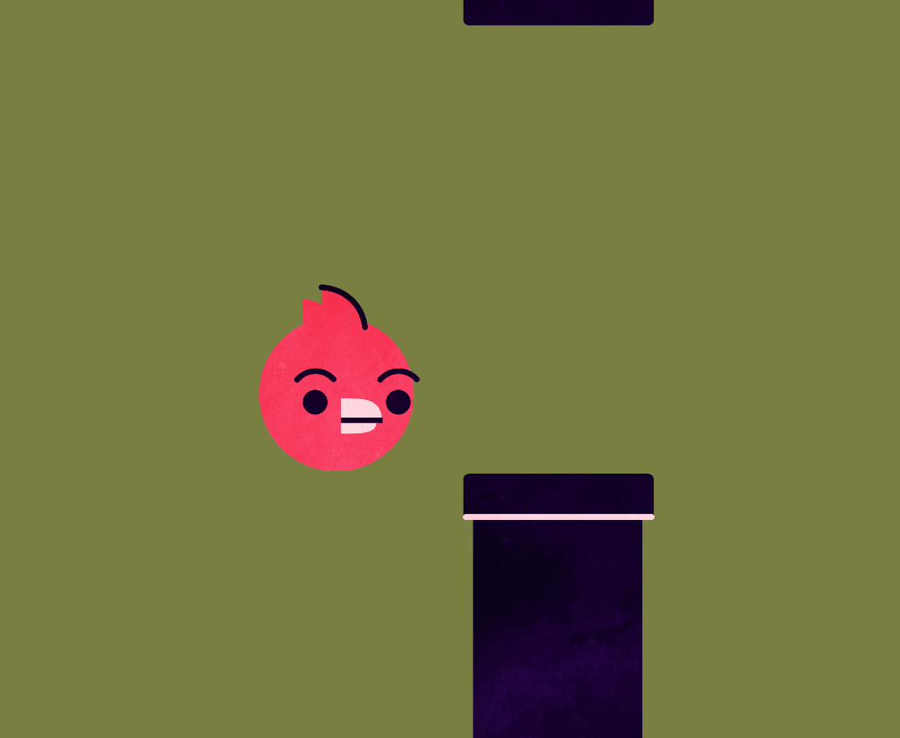

# Flappy Bird Clone - Unity Game



## Overview

This project is a Flappy Bird clone created using the Unity game engine. The game features classic Flappy Bird gameplay where the player controls a bird, navigating it through a series of obstacles by tapping the screen to keep it airborne. The objective is to score as many points as possible by passing through the gaps between pipes.

## Features

- **Classic Gameplay**: Tap to make the bird flap its wings and navigate through obstacles.
- **Randomized Obstacles**: Pipes are randomly generated to provide a unique challenge each time.
- **High Score Tracking**: Keep track of your highest score to challenge yourself.
- **Simple Controls**: Play using simple tap or click controls.
- **Sound Effects**: Includes free sound effects to enhance gameplay experience.

## Getting Started

### Prerequisites

- Unity 2019.4 or higher

### Installation

1. Clone the repository:
   ```sh
   git clone https://github.com/YourUsername/FlappyBirdClone.git

## Contribution
Contributions are welcome! If you have suggestions or find issues, please open an issue or submit a pull request.

## License
This project is licensed under the MIT License - see the LICENSE file for details.

## Acknowledgements
Developed by Tiago Aleixo   
Inspired by the original Flappy Bird game created by Dong Nguyen.

For more information, refer to the <a href="https://github.com/Tigas143/flappy-bird-game">repository</a> on GitHub.